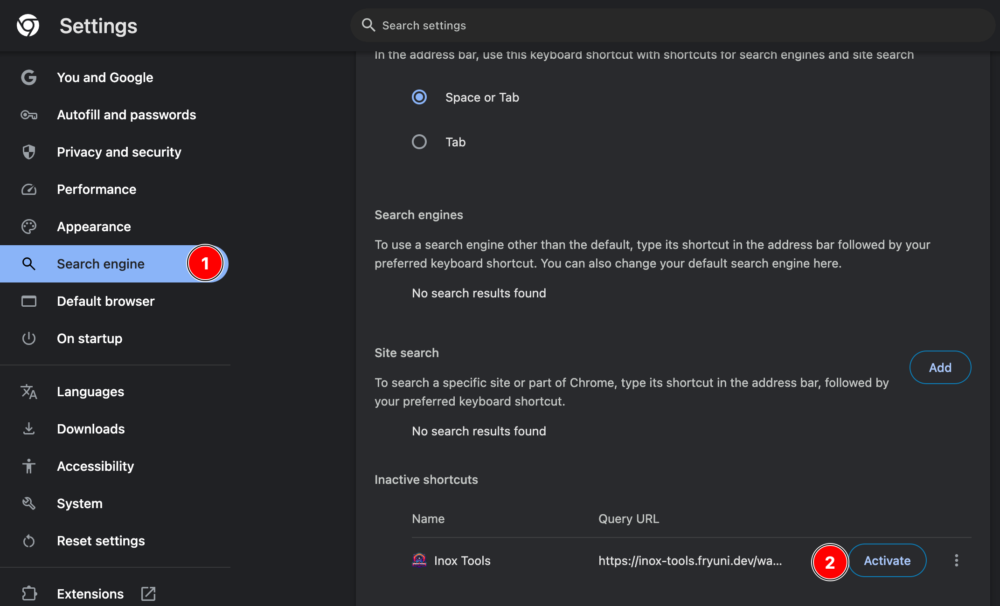
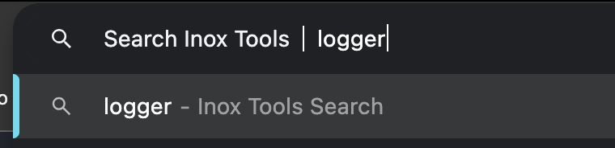
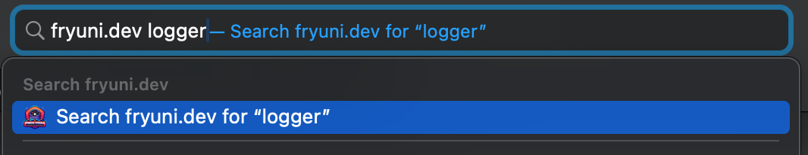

This integration adds a quick "jump to first search result" URL to any Astro site using Pagefind. With that, your users can search within your website from their browsers search bar directly.

## Installing the integration

import { PackageManagers } from 'starlight-package-managers';

<PackageManagers type="exec" pkg="astro" args="add @inox-tools/star-warp" />

## How to use

With the integration installed, navigating to `<your site>/warp?q=your search term` will navigate to the first result of that search.

For example, go to https://inox-tools.fryuni.dev/warp?q=logger and see where you land :)

This works completely statically, you don't need SSR to use this integration.

## Using with Starlight

This integration is also a Starlight plugin to get better defaults from your Starlight site!

Just move it from the `integrations` property on your `astro.config.mjs` to the `plugins` property in side the Starlight integration:

```ts title="astro.config.mjs" del={9} ins={7}
import starlight from '@astrojs/starlight';
import starWarp from '@inox-tools/star-warp';

export default defineConfig({
	integrations: [
		starlight({
			plugins: [starWarp()],
		}),
		starWarp(),
	],
});
```

## OpenSearch

You can enable the generation of an OpenSearch Description with the following configuration:

```ts title="astro.config.mjs" ins={6-8}
import starWarp from '@inox-tools/star-warp';

export default defineConfig({
	integrations: [
		starWarp({
			openSearch: {
				enabled: true,
			},
		}),
	],
});
```

With OpenSearch enabled, add the following to the `<head>` block of your pages:

```html ins={2-7}
<head>
	<link
		rel="search"
		type="application/opensearchdescription+xml"
		href="/warp.xml"
		title="Astro Site"
	/>
</head>
```

The `href` property is defined by your project's [`base`](https://docs.astro.build/en/reference/configuration-reference/#base) and OpenSearch [`path` parameter](#path). The `title` property can be anything you want, it will be used by the browser when displaying the search bar.

:::tip
The tag is added automatically to Starlight pages when used as a Starlight plugin.
:::

### Using on browsers

#### Chrome

Chrome will automatically load the OpenSearch Description once you navigate to any page with the link tag, but it will keep it deactivated. To enable it:

import { Steps } from '@astrojs/starlight/components';

<Steps>

1. Go to the [Chrome Settings Search Engine](chrome://settings/searchEngines) page.

2. Search for your site under "Inactive shortcuts".

3. Click on the "Activate" button.

</Steps>



Once activated, typing anything after the domain will switch the Omnibox to searching on your website:



#### Safari

Safari will automatically load the OpenSearch Description once you navigate to any page with the link tag. From then on, you'll see an option to search the site when typing anything after the site:



## Configuration

### `path`

**Type:** `string`  
**Default:** `/warp`

The path of the warp route.

### `openSearch.enabled`

**Type:** `boolean`

Whether an OpenSearch Description should be generated on the configured [`path`](#path) followed by `.xml`.

Defaults to `false` when used as an Astro Integration and `true` when used as a Starlight plugin.

### `openSearch.title`

**Type:** `string`

The OpenSearch Description's site search title.

Defaults to the Starlight title when used as a Starlight plugin and the string "Astro Site" when used as an Astro Integration.

### `openSearch.description`

**Type:** `string`  
**Default:** `Search <title>` where `<title>` is the [OpenSearch Description's site search title](#opensearchtitle).

The OpenSearch Description's site search description.

## License

Star Warp is available under the MIT license.
